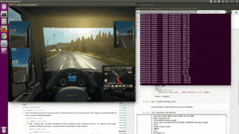
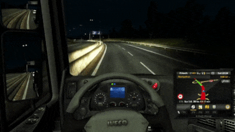

# europilot

## Overview





Europilot is an open source project that leverages the popular Euro Truck Simulator(ETS2) to develop self-driving algorithms. Think of europilot as a bridge between the game environment, and your favorite deep-learning framework, such as Keras or Tensorflow. With europilot, you can capture the game screen input, and programmatically control the truck inside the simulator. 

Europilot can be used in one of two ways: training or testing. 

For training, EuroPliot can capture the screen input and ouput a numpy array in realtime, while simultaenously getting the wheel-joystick values. The mapping between the relevant screenshot and the joystick values is written inside a csv file.
<div align = 'center'>
	
</div>
<p align = 'center'>
In the csv file, each row has the screenshot filename with the joystick values. 
</p>

For testing, europilot can create a virtual joystick driver that can be recognized inside the game, which can be used to programmatically control the truck. Using this joystick, you can create a real-time inference network that uses the game screen as the input, and outputs the relevant joystick commands, such as steering. 

[Click to see an example demo on YouTube.](https://www.youtube.com/watch?v=n2pPR3WLaxI)

## Getting Started

First, clone the project

```
git clone git@github.com:marshq/europilot.git
```

If you want to install europilot locally,

```
python setup.py install
```

You can also install prerequisite libraries and do something directly in this project path.

```
pip install -r requirements.txt
python
```
```python
>>> import europilot
>>> europilot.__version__
'0.0.1'
```

To start generating training data, check out [generate_training_data.py](scripts/generate_training_data.py) in the scripts directory.

NOTE that `opencv` compiled with `opencv_contrib` module is required to use screen selection gui.

Otherwise, you should specify a screen area in which will be captured by assigning custom `Box` object to `train.Config.BOX`.

After the generation of training data is finished, you may want to manually inspect each image to check if unwanted data was recorded. Check [clean_up.ipynb](scripts/01.clean_up.ipynb) for a simple script to remove unwanted data together with the accompanying row in the csv file. Also check out [preprocess.ipynb](scripts/02.preprocess.ipynb) and [get_mean_std.ipynb](scripts/03.get_mean_std.ipynb) for an example code to preprocess the data.

[PilotNet.ipynb](scripts/04.PilotNet.ipynb) is an implementation of Mariusz Bojarski's [End to End Learning for Self-Driving Cars](https://arxiv.org/abs/1604.07316), with slight differences. The demo shown above was created with the following notebook.

For running inference on the model, check out [inference.ipynb](scripts/04.inference.ipynb) in the scripts directory.

## General Architecture

Europilot hides the complexity of capturing the screen data and joystick data with a simplified interface. Internally, the joystick datastream is parsed into a machine readable format, which for us was a Logitech G27. If you have a different joystick, modify [joystick.py](europilot/joystick.py) to your needs.

We currently have [example notebooks](scripts/) implemented with Keras. We hope to add more examples in other popular frameworks.

A virtual joystick driver is implemented by attaching userspace drivers in the kernel, by outputting events into udev. This driver can be recognized inside ETS2. Please note that the driver must be initialized before the game is started, or else it will not show up in the controller page.

## Why Euro Truck Simulator 2?

Europilot captures the screen input, therefore technically it is game agnostic. We chose ETS2 as our first target for several reasons.

* Multi platform support: ETS2 supports Windows, OS X, and Linux. Developers can run the game in a Macbook, or in a Ubuntu workstation. This put ETS2 ahead of games such as GTAV.


* Realistic graphics/physics: We looked at open source games, but found that the graphics or physics engine was not realistic enough for our use case. ETS2 afterall, has "simulator" inside its title.


* Fun: Having a large dataset is critical to developing a good model. Therefore you, as a developer, have to play many hours of whatever game you target. Fortunately, ETS2 is fun to play!

## Documentation

For now, refer to the README and the source code.

## Compatibility

Europilot runs on OS X, Linux. It supports python 2.6-2.7 and 3.3+.

## How to Contribute

Any contribution regarding new feature, bug fix and documentation is welcomed.

But we highly recommend you to read this guideline before you make a pull request.

### Coding convention

We generally follow PEP8 with few additional conventions.

* Line-length can exceed 79 characters, to 100 in case of comments.
* Always use single-quoted strings, unless a single-quote occurs within the string.
* Docstrings use double-quote.

### Roadmap

Feature roadmap includes

* Run ETS2 on virtual machine and train/test a model remotely
* Web leaderboard
* Capture custom(ex. left, right side cam) vision data while driving in ETS2
* Support reinforcement learning workflow which is simliar to openai universe
* Windows support, if there is demand.

## License

This project is licensed under the MIT License.
